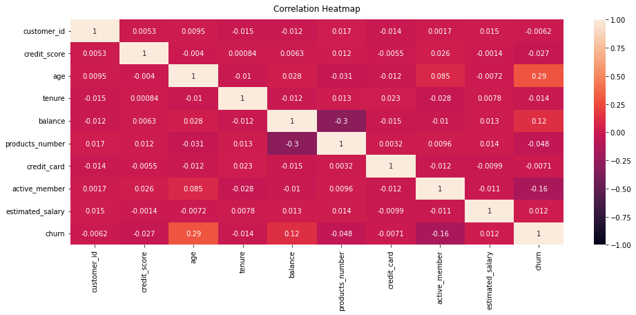

# &nbsp; &nbsp; &nbsp;&nbsp; &nbsp; &nbsp; &nbsp; &nbsp; &nbsp; &nbsp; &nbsp; &nbsp; &nbsp; &nbsp; &nbsp; &nbsp; Customer Churn Prediction

#### Introduction:

Customer retention appears to be a crucial & fundamental necessity for every business, given the significance of customers as the most valuable assets of enterprises. Banks are no exception to this rule.  Customer retention is more important than ever given the competitive environment in which multiple banks are competing to provide various facilities including electronic banking services to stand out among the rest.

Carrying this notion in mind we are aiming to take the first step in this quest of finding the slips of the enterprise by finding out the customer churn rate (Churning refers to a customer who leaves one company to go to another company) which in turn will sketch the picture of how the enterprise is performing in current market scenario and then finding the reason of fallouts and hopefully implementing improvements to reverse the current situation. 

#### Dataset Description (Shweta):

The dataset we are working with on for this project contains 12 features and about 10000 rows of customer data from a bank in Europe. 

   

#### EDA:

- The Dataset contains `10,000` rows of dataset values.
- The Dataset has the following Columns: customer_id,credit_score,country, gender, age, tenure, balance, products_number, credit_card, active_member, estimated_salary, churn (Target Label; 0 - No; 1 - yes).
- We have around `7,963` rows corresponding to Churn as **No**
- We have `2037` rows corresponding to Churn as **Yes**.
- We have the ratio of skewnesss `4:1` for every 4 values of churn as "No" we have, 1 value of Churn as "Yes". Therefore, we could see some skewness in the dataset.

- From the correlation heatmap we could see that there is good correlation between `active-member - age`, `age - Churn` we need to take a look at more of the features more.

#### Goal:

- It is Imperative that the businesses take the right decisions and to maintain good customer base with good retention. This would lead to good business growth and finally affects the bottom-line for the company in the end.
- This dataset which contains the churn data, looks at tall the features which might affect the customer churn rate and by applying smart ML algorithms, we could actually help predict whether the customer is retained or could leave the bank. 
- Through this, we could help the bank identify `Focus groups` in-order to target them and help the banks retain these customer.

#### Hypothesis (Shweta):

- What are we trying to look at?
- Who care and what are we doing to address the issues
- How will you gain from the knowledge
- What do you hope to do it from the application.
